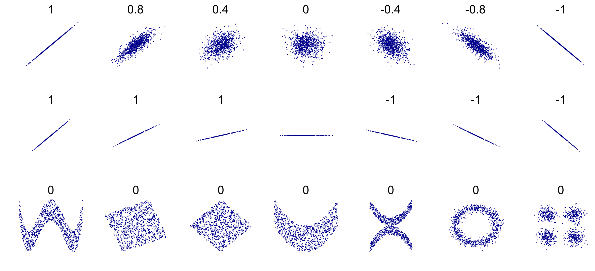

This lab focuses on statistics and data visualization, with the aim of using CTD data to look for relationships in oceanographic data. The tools you are introduced to here can be used to graph and analyze data in your labs, your independent research projects and the cruise data gathered throughout the semester. Be sure to save any scripts that you develop so you can continue to use them.

# 1. Importing Data

Last class, we used a csv file that was ready to import into R. More often than not, you'll have to wrangle your data into a form that is readable by R. Today, we'll take a step backwards from where we started last week, and start by creating the csv file to import into R.

1. Open Colby_cruise_data_2012-2017.xlsx
2. Go to the "CTD all years" sheet
3. Go to "File" -> "Save As" and select to save the file as a "CSV (Comma delimited)" file (selecting "yes"" to the windows that pop up)
4. Open the csv file you just created
5. Delete the 2nd row and remove the notes that are to the right hand side of the data
6. Remove units from column names and change the last two columns to "O2Conc" and "O2Saturation"

You should be left with a rectangular block of numbers, with the first row as "headers" or column names, which looks the same as the file we started with last week.

Let's read in the data:

```{r}
DATA<- read.csv("Colby_cruise_data_2012-2017.csv", header=TRUE)

```

# 2. Scatter plots, correlations and linear regressions

In this section, we'll make use of ggplot, part of the tidyverse package. The tidyverse is a group of R packages designed for data science. We need to install this package before using it:

```{r}
install.packages("tidyverse")
```

For more information on the tidyverse see https://www.tidyverse.org/

### Question: How are two variables related?

### Objectives:

1. Visualize relationships and correlations between variables
2. Use appropriate statistics to describe the relationships.

## 2.1 Scatter plots

Scatter plots allow us to quickly understand and visualize relationships.

#### Example: How is chlorophyll fluorescence related to temperature?

```{r, fig.height = 5, fig.width=5}
library("ggplot2")

ggplot(data = DATA) + 
  geom_point(mapping = aes(x = Temperature, y = Fluorescence),color="skyblue",shape=18,size=1) +
  xlab('Temperature (deg C)') +
  ylab('Fluorescence (mg/m^3)') +
  coord_cartesian(xlim=c(7,18), ylim=c(0,12)) 
```

The above is a great visual tool - but how do we define this relationship scientifically and statistically? We'll look at two different techniques, but often scientists tend to use both of these.

**Resource for ggplot:** http://r4ds.had.co.nz/data-visualisation.html

**Cheatsheet for ggplot:** https://www.rstudio.com/wp-content/uploads/2015/03/ggplot2-cheatsheet.pdf

## 2.2 Correlations

In everyday speech, *correlation* is often used interchangeably with relationship and is defined as:

> the state or relation of being correlated; specifically : a relation existing between phenomena or things or between mathematical or statistical variables which tend to vary, be associated, or occur together in a way not expected on the basis of chance alone.

How is correlation defined in a mathematical sense? Using *correlation coefficients*.

### 2.2.1 Correlation coefficients

There are a range of different correlation coefficients, but the most common of these is the *Pearson correlation coefficient*. The Pearson correlation coefficient, often referred to as simply the correlation coefficient, is given the symbol $r$ and describes the linear correlation between two variables. It takes a value between -1 and 1, where a value of 0 indicates no linear correlation and values further from 0 in either direction (closer to -1 and 1) indicate stronger linear correlations. The sign of the correlation coefficient describes the direction of the correlation e.g. a positive $r$ indicates a positive relationship between the variables. See the image below for examples.


https://en.wikipedia.org/wiki/Pearson_correlation_coefficient#/media/File:Correlation_examples2.svg

#### Example: What is the correlation coefficient between chlorophyll fluorescence and temperature?

```{r}
# create variables for our two parameters of interest
# NB: we want to the data to be vectors, rather than dataframe columns so we can perform our analysis, hence we need to use two brackets, [[]], to index the DATA dataframe
temp <- DATA[['Temperature']]
fl <- DATA[['Fluorescence']]

# calculate the correlation coefficient
corValue <- cor.test(temp, fl, method="pearson")

# displaying the correlation coefficient
corValue
```

## 2.3 Linear regressions

The relationship between two variables can be explained through a simple linear regression (here *simple* refers to the fact two variables are being related). The main outputs from this kind of analysis are a line or curve of best fit and various *summary statistics* or *goodness-of-fit statistics* or *explanatory variables* which define how good the linear regression is. This analysis can be extended to describe relationships between multiple variables via linear multiple regression analysis.

### 2.3.1 Best fit line

#### Example: What is the line of best fit between the chlorophyll fluoroescence and temperature?

```{r, fig.height = 5, fig.width=5}
# fitting a linear model between the two variables
model1 <- lm(fl ~ temp)

# assigning the slope and intercept fromt the model to variables
slope <- model1['coefficients'][[1]][[2]]
intercept <- model1['coefficients'][[1]][[1]]

# adding the line to our plot: note we've added the line by three different methods
p <- ggplot(data = DATA) + 
  geom_point(mapping = aes(x = Temperature, y = Fluorescence), color='skyblue', shape=18,size=1) +
  geom_smooth(mapping = aes(x = Temperature, y = Fluorescence), method = lm, se = FALSE, color='blue') +
  geom_abline(slope=slope,intercept=intercept, size=1, color = "darkblue") +
  stat_function(fun = function(x) intercept + slope * x, size = 1, color = 'blue') +
  xlab('Temperature (deg C)') +
  ylab('Fluorescence (mg/m^3)') +
  coord_cartesian(xlim=c(7,18), ylim=c(0,12)) 

# let's add the equation to the figure
p + annotate("text", x = 9, y = 11, label = paste("Temp = ", format(slope, digits=3), "Fluor + ", format(intercept,digits=3), sep=""))


```

##### **Important side note about linear regressions**

An important point to note is what makes a regression a *linear* regression. **It is not that you fit a straight line through your data.** We could in fact fit a quadratic or higher order polynomials to our data using linear regression techniques (see below): 

```{r, fig.height = 5, fig.width=6}
# fitting a 2nd and 3rd order polynomial between the two variables
model2 <- lm(fl ~ temp + I(temp^2))
model3 <- lm(fl ~ temp + I(temp^2) + I(temp^3))

# assigning the coefficients from the models to the variables
p2 <- model2['coefficients'][[1]][[3]]
p1 <- model2['coefficients'][[1]][[2]]
p0 <- model2['coefficients'][[1]][[1]]

q3 <- model3['coefficients'][[1]][[4]]
q2 <- model3['coefficients'][[1]][[3]]
q1 <- model3['coefficients'][[1]][[2]]
q0 <- model3['coefficients'][[1]][[1]]


# adding the line to our plot: note only one of the above methods works for curves, stat_function
ggplot(data = DATA) + 
  geom_point(mapping = aes(x = Temperature, y = Fluorescence), color='cornflowerblue', shape=18,size=1) +
  geom_smooth(mapping = aes(x = Temperature, y = Fluorescence, color='line'), method = lm, se = FALSE,size=1.2) +
  stat_function(fun = function(x) p0 + p1 * x + p2 * (x^2), size = 1.2, aes(color = '2nd order')) +
  stat_function(fun = function(x) q0 + q1 * x + q2 * (x^2) + q3 * (x^3), size = 1.2, aes(color = '3rd order')) +
  scale_colour_manual("",values = c("darkblue", "orange", "blue")) +
  xlab('Temperature (deg C)') +
  ylab('Fluorescence (mg/m^3)') +
  coord_cartesian(xlim=c(7,18), ylim=c(0,12)) 

```

What makes it a *linear* regression is the coefficients of the fit are linear. In the above plot, the equation for the quadratic is given by $y=0.036x^2-0.490x+1.700$. This equation is non-linear in the $x$-variable, but linear in the coefficients.

#### **How do linear regressions work?**

Linear regressions typically use a least squares method to determine the best fit line. The method aims to minimise the sum of the squares of the distance between all the data points and the fitted line (the *residuals*). 

### 2.3.2 Summary statistics

There are a variety of different statistics which are used to describe how well the linear regression describes the relationship between the two variables. Here, we will consider the following variables:

1. Coefficient of determination, $R^2$ : gives a measure of how much of the variability of the $x$-variable is explained by the $y$-variable. For simple linear regressions which include the intercept term, $R^2=r^2$, i.e. the coefficient of determination is equal to the square of the correlation coefficient.

2. Adjusted $R^2$ : If there are multiple variables or terms included in the relationship (e.g. the quadratic curve has an $x$ term and an $x^2$ term), then the adjusted $R^2$ takes into account only the variables or terms which affect the $y$ variable.

3. $p$-value : describes the probability of the null hypothesis being true. In the case of linear regression analysis, the null hypothesis is there is no relationship between the two variables. If the $p$-value is found to be below a given significance level, typically taken as 0.05 (or 5%), then the null hypothesis can be rejected i.e. there is a statistically significant relationship between the two variables.

4. Residual standard error or the root mean squared error : in R, these are equivalent. The *standard error* is defined to show how far the sample mean is from the population mean. It is calculated by dividing the *standard deviation* by the square root of the number of data points. The *standard deviation* is a  measure of how much the data points differ from the mean. For a linear regression, the *root mean square error* is estimated by taking the square root of the mean of the residuals-squared (or put another way, by dividing the square of the residuals by the number of data points, and taking the square root). By virtue of the least squares fitting procedure used in the linear regression, the mean of the residuals are zero. Hence, mathematically, the root mean square error and the residual standard error are the same, and in this case give an overall idea of how close the data points are to the fitted line.

#### Example: Does the straight line, quadatratic or 3rd order polynomial describe the relationship between chlorophyll fluorescence and temperature best?

```{r}
# printing a summary of the 3 different fits
summary(model1)
summary(model2)
summary(model3)

# assigning summaries to variables
sum_model1 <- summary(model1)
sum_model2 <- summary(model2)
sum_model3 <- summary(model3)

# combining statistics into vectors
rsquare = c(sum_model1$r.squared,sum_model2$r.squared,sum_model3$r.squared)
adjrsquare = c(sum_model1$adj.r.squared,sum_model2$adj.r.squared,sum_model3$adj.r.squared)
std_error = c(sum_model1$sigma,sum_model2$sigma,sum_model3$sigma)

# unfortunately we can't extract the p-value in the same way, but we can calculate it separately
pvalue = c(pf(sum_model1$fstatistic[[1]],sum_model1$fstatistic[[2]],sum_model1$fstatistic[[3]],lower.tail = FALSE),
           pf(sum_model2$fstatistic[[1]],sum_model2$fstatistic[[2]],sum_model2$fstatistic[[3]],lower.tail = FALSE),
           pf(sum_model3$fstatistic[[1]],sum_model3$fstatistic[[2]],sum_model3$fstatistic[[3]],lower.tail = FALSE))


# creating a dataframe containing the model statistics
statsData = data.frame(rsquare,adjrsquare,std_error,pvalue,row.names=c("model1","model2","model3"))
statsData

# note: a quick & easy way to pull out the model coefficients and their associated statistics, displaying them in a digestable form, is to use the tidy function from the broom package (part of the tidyverse)
library("broom")
tidy(model1)
```

# 3. Temperature-Salinity Diagrams

A special kind of scatter plot used in oceanography is a Temperature-Salinity diagram or T-S diagram. A T-S diagram is a great way to visualize the different water masses present in your data. 

We've written a short R function that plots a T-S diagram from your CTD data. We'll need to import a couple of packages for it to work though:

```{r}
install.packages("marelac")
install.packages("plot3D")
```


```{r}
#load the function into your R workspace:
source('TSdiagram.R')

#call the function:

TSdiagram(DATA[["Temperature"]],DATA[["Salinity"]]) 
```

What we get is a plot of temperature vs salinity, with lines of constant density, or sigma (at an assumed atmospheric pressure of 1 bar).

We can also look at how other variables are related to temperature and salinity by plotting the color of the points based on the variable value:

```{r}
TSdiagram(DATA[["Temperature"]],DATA[["Salinity"]],DATA[['Fluorescence']],'Fluorescence (mg m^-3)',clim=c(0,11)) 
```


# 4. Assignment

1. a) For the example given in the lab (chlorophyll fluorescence and temperature)

        i. Are the variables correlated? 

        ii. How well does a linear regression represent the relationship?
      
        iii. What ocean process(es) might produce this relationship?
      
    b) Repeat (a) for two more pairs of variables. 
      
2. Try plotting two more T-S diagrams, each with a different variable represented by the color of the points. Write a couple of sentences describing what these plots tell you about the different waters sampled on the cruises.

**Email me (cmitchell@bigelow.org) your assignment, including the scripts and figures you made.**


